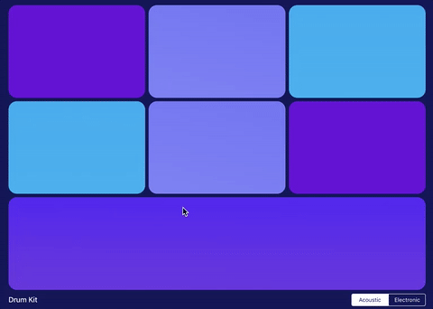
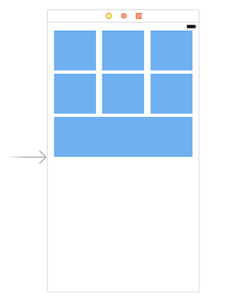
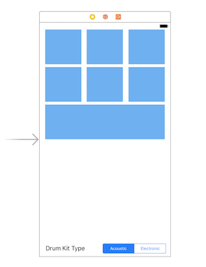
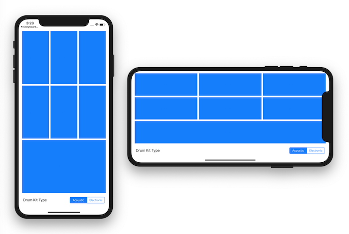
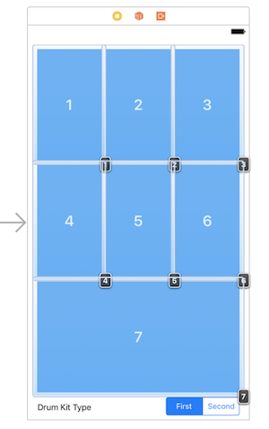

# Lab 3: Drummer

## Getting Started

1. Open Terminal and navigate to the `iosdecal-sp19` directory using `cd`.

2. Use `git pull` to fetch this lab's starter code.

In today's lab, we'll be creating a responsive UI for a simple drum pad app using AutoLayout and hooking up to code with MVC.

Open the file `Drummer.xcodeproj` to start the lab. We have provided the following files for you to use. 

1. `Drumkit.swift` in the `Model` folder - this file contains the "brains" of our app, including the filenames for the audio files that we'll be using, as well as a method for playing these audio files. You (probably) won't need to modify this file, but please read through it before starting the lab! It'll make understanding things much easier :)

2. `DrummerViewController.swift` in the `Controller` folder - this file contains the ViewController class that will connect our View created in Interface Builder to our Model. You will be adding code to this file in this lab.

3. `Main.storyboard` in the `View` folder - this is where you will be creating your UI elements (buttons, labels, etc) and AutoLayout constraints. This file is automatically created for you each time you start a new Xcode project.

4. `Supporting Files` - contains all the audio clips we'll be using, as well as some other files we won't be using in today's lab (Ask a TA if you want to learn about them!)

Good luck, and don't be afraid to ask other students in your group or the TAs for help if you're stuck!

## Part 1: Adding UI Elements to the View

Once you've familarized yourself with the starting files we've given you, open `Main.storyboard` to start with Storyboard.

We have a total of 7 drum sounds, so we'll need to create 7 UI Buttons in our storyboard. **Create 7 buttons, and add them to your view in the arrangement below.** Since we want each button to play a unique sound, give each button a unique integer tag from 0 to 6 (you can change a button's tag value using the *Attributes Inspector*, under *View*)

Let's add two more UI elements. **Add one Label and one Segmented Control to the bottom of your view**. We'll use these to switch between drum kits (different drum kits will have different sound files associated with them). Edit your UI Label to display "Drum Kit Type", and change the values of your Segmented Control to "Acoustic" and "Electronic"

Try building your project now by pressing `Command + R` or the "Run" button at the top left corner of Xcode. You'll see that the UI looks different than it does in the Interface builder, and that there is a lot of extra white space. You can rotate the simulator by pressing `Hardware > Rotate` to reveal some more UI issues. To fix these problems, let's use some AutoLayout!

## Part 2: Autolayout Constraints

For our app, we want to minimize the amount of whitespace by making the buttons as large as they possibly can be given the size of our screen. Instead of hard-coding in values for our buttons, we'll create constraints between each UI element.

**You may add as many or as few constraints as you wish, but you must ensure the following to get credit for this lab:**

1. Every button should stretch in width and height to fill the entire screen *(no hardcoded values for height and width!)*
2. All buttons must have the same height
3. The first 6 buttons should have the same width and height
4. The horizontal and vertical spacing between each button must be equal
5. The label and the segmented control should remain the same height, regardless of screen size (Constrain their heights to a certain value).

**Use the image below as a guide to make sure that you made your constraints correctly.** Even though the screenshot only shows the UI for an iPhone XR, your app's UI elements should resize for any device size).

You are free to customize your UI however you'd like, as long as the constraint requirements listed above are satisfied.

 
**Hint 1**

To refresh your memory, you can create constraints in Storyboard by first clicking on a UI element, holding down `Control` and then dragging your cursor to another UI element or view. To fine-tune your constraints, open the Size Inspector in the Utilities pane. Scroll downwards to view all constraints on your UI element.

 
**Hint 2**

Don't forget about [StackViews](https://developer.apple.com/documentation/uikit/uistackview)! They're great for displaying elements in a grid-like formation.

## Part 3: Connecting the Model, View, and Controller

Now that you've finished the UI, we can now connect our View to our Model.

### a. Creating Outlets for the Drum Buttons in DrummerViewController.swift

Now we can start connecting the UI elements we created in our Storyboard to our ViewController file so we can edit them programmatically.

Open the Assistant Editor so that `Main.storyboard` and `DrummerViewController.swift` are both open. "`DrummerViewController`" is the custom controller class associated with the view in `Main.storyboard`. Usually, you will have to set each of your ViewController's custom classes in the Identity Inspector in Interface Builder on your own, but we have done this step for you.

Since we want our drum pad buttons to play an audio clip when pressed, we'll want to create an action in our ViewController that will be called each time the user taps a button. **To do this, `Control-Drag` from one of your buttons to an empty line in `DrummerViewController.swift`**. The Connection should be an Action, the sender type should be set to UIButton, and the function name should be set to "`drumButtonWasPressed`".

<small>
*Note: We're setting the sender type to UIButton here (as opposed to leaving it on Any) because later on we're going to be using the `tag` property. If we don't set the sender type, Swift will get confused and throw an error because not all interactable elements have the `tag` property.*
</small>

Since we want all of our buttons to activate this method (not just this one button we control + dragged from), **connect all your other buttons to the IBAction "drumButtonWasPressed"**. Refer to the demo from last lecture if you need a reminder on how this works.

To check that all your buttons were successfully connected to the IBAction, hover over the small circle next to "drumButtonWasPressed" in DrummerViewController.swift. All 7 buttons should appear highlighted in your Storyboard.

### b. Adding Sound

Now we have an action method that will be called any time a user taps one of the drum buttons. As of now, nothing will happen. Since we want a drum sound to be played each time a user taps a button, **add some code to our new `drumButtonWasPressed` method to allow each button to play a different sound clip**. If all buttons play the same sound clip, make sure you set the "Tag" property for each button correctly in Part 1.

 
**Hint**

If you're stuck, take a look at `DrumKit.swift` in the `Model` folder. Perhaps there's a method implemented there you could call on in your controller?

### c. Switching Between Drum Kits 

Right now, we can't switch between drum kits (tapping on the segmented control doesn't change anything). To fix this **create an IBAction in DrummerViewController.swift for the Segmented Control** in the same way as done above. Set the sender type to UISegmentedControl. You can name the method whatever you like, but we'll call it "`drumKitWasChanged`".

**Fill in the `drumKitWasChanged` method** to allow the user to switch between drum kits by updating the "currentDrumKit" variable. If you implemented the method correctly, tapping on the Segmented Control in your app should change the sound of each drum button.

 
**Hint**

You'll want to use your UISegmentedControl property `selectedSegmentIndex`, which you can access using `sender.selectedSegmentIndex`.

## Part 4: Checkoff

We will check off your work based off the following criteria (all requirements must be satisfied to receive credit).

1. All buttons and UI elements must dynamically change as shown in the preview gif for any device size and orientation (use the image in part 3 as a guide for how your app should look).
2. Tapping on a drum button must play a sound (your app needs to work!)
3. The Segmented Control should be able to switch between the two drum kit sounds

   