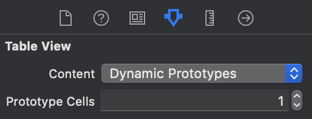
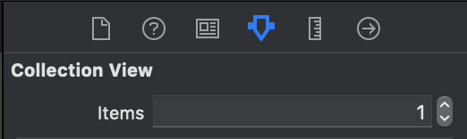
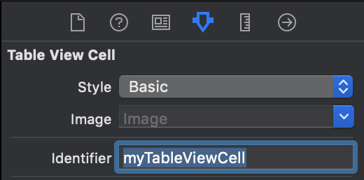
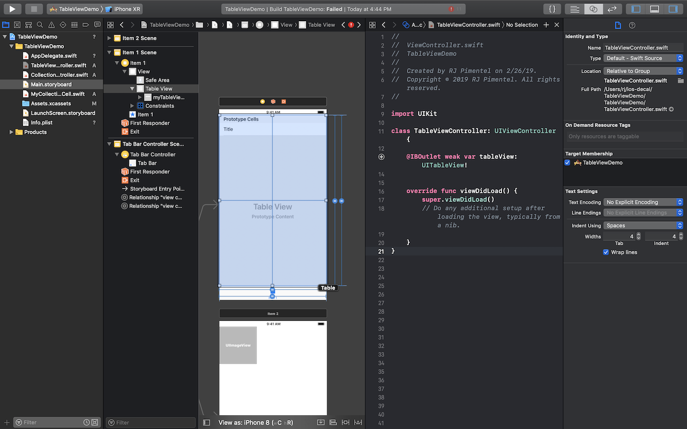
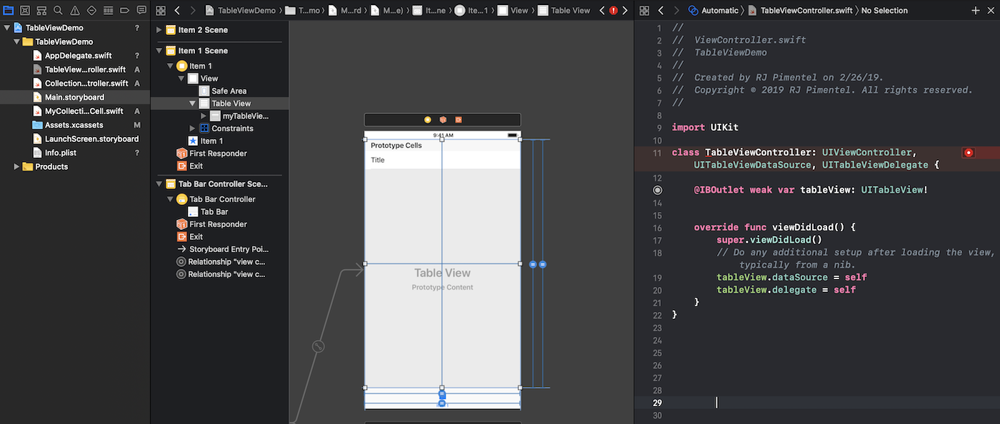
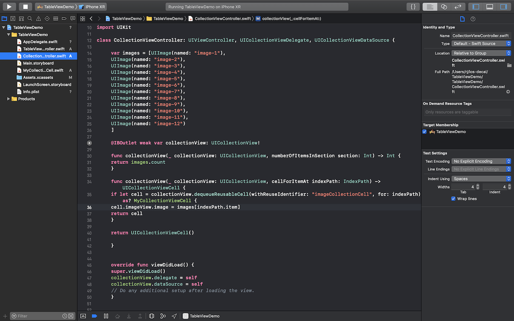

# Implementing UITableViews and UICollectionViews

## 1. The Storyboard

* We'll first add a `UITableView` and `UICollectionView` to our storyboard file and set its constraints (In order to switch between the two views, we've included a `Tab Bar Controller` which will add a tab bar to the bottom of the views)

* We are going to need two `ViewController` classes, one for each view in our storyboard. Create two new `Cocoa Touch` files, `TableViewController` and `CollectionViewController`, each subclassing `UIViewController`.

* In order to set outlets from our storyboard to these new files, set the `Custom Class` property in the `Attributes Inspector` to match the titles of our new classes. 

* We'll set outlets for our TableView and CollectionView later.

* Next, you're going to want some `prototype cells`. Each `prototype cell` will define a different UI Layout for that specific cell type. If you only have one type of cell in your `UITableView` or `UICollectionView`, you will only need one prototype cell. 

* You can set the number of prototype cells for a `UITableView` or `UICollectionView` in the `Attributes Inspector` (`UICollectionViews` use the property `items` instead of `prototype cells`).

 

* Now, we will create the layout of our cells. Say we want a label in our `UITableViewCells` and an image in our `UICollectionViewCells`. `UITableViews` have some predefined layout styles. The `Basic` style includes a single label, which is what we want here. If we wanted to create our own custom layout, we would set the style to `Custom`.

* For `UICollectionViewCells`, there aren't any predefined styles, so we will drag an `ImageView` object into the cell. We'll set the constraints for the `ImageView` to be centered in the cell and have equal widths/heights. 

* Lastly, we need to set the `Reuse Identifier` property for our cells so we can reference them in code. Click on each cell and set the `Identifier` property in the `Attributes Inspector`. 

* Now, we need a custom class for our `UICollectionViewCell` so we can access its `ImageView` as an outlet. If we had set our `UITableViewCell` style to `Custom` and implemented a custom layout, we would have to do the same. Create a custom `Cocoa Touch` class that subclasses `UICollectionViewCell`. 

* Finally, set the class property of our `UICollectionViewCell` to match the name of our new class. Now we can create an outlet for our `ImageView` in our newly defined class. 

 

Your storyboard file should now be complete! Now, let's write some code. 

## 2. The Code

* We'll start with `TableViewController.swift`. Create an outlet from our `UITableView` object in the storyboard to our code.

* Next, we'll want to implement two protocols in our View Controller: `UITableViewDelegate` and `UITableViewDataSource`. In the `viewDidLoad` method, set the `delegate` and `dataSource` properties of our `UITableView` outlet to `self`. This will tell our table view to get its data and interface information from this view controller (note: in large projects, we generally have different files as the `dataSource` or `delegate` for our objects, but in small projects you can consolidate them all into one file).

* You'll notice an error has emerged - it turns out `UITableViewDataSource` has two required methods. Click on the error and click `Fix` to add the protocol stubs. 

* These methods look ugly to some legacy implementations in Objective-C, but you can differentiate them using their arguments. The first method is referred to as `numberOfRowsInSection` and the second is known as `cellForRowAt`. `numberOfRowsInSection` returns the number of rows in a given section (if we only have one section, we just return the total number of cells). `cellForRowAt` will need to return a `UITableViewCell` object for a certain index.  

*  We'll add some data to display in an array called `titles`. For `numberOfRowsInSection`, we'll simply return the length of the array. For `cellForRowAt`, we'll deque the cell using the identifier set previously. The `Basic` cell style contains a property called `textLabel`, so we'll set the label text to a value at a certain index of our array. To get the integer index of the cell we're creating, use `indexPath.row`. 

* Now we should have a working `UITableView`! Run your app and you should see the data displayed like so:

* The implementation is virutally the same for `UICollectionViews` besides for some semantic issues with method names. Also, because we used a custom `UICollectionViewCell` class, we'll need to cast the cell as our custom class when we deque it. Refer to the code below:

* You can also modify the `cell size` and `min spacing` attributes for the collection view in the `size inspector`. Messing around with these values, you should be able to construct something that looks like:

That's it! Now you should have the core fundamentals of CollectionViews and TableViews down.

																																								

