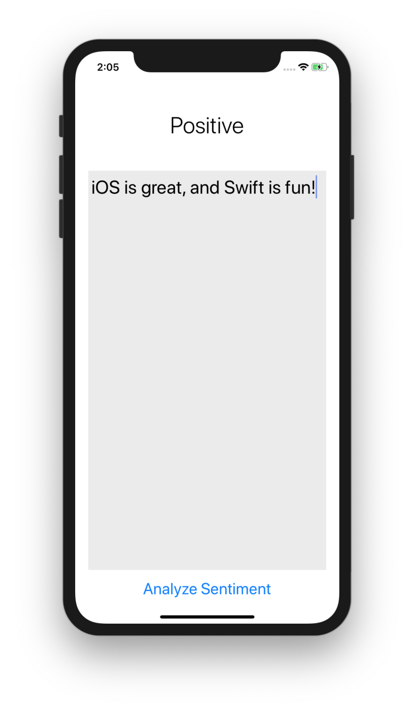
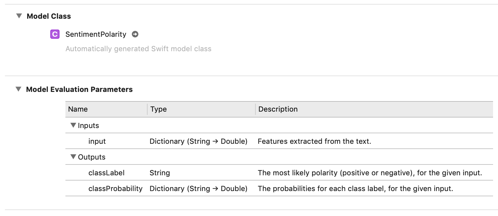

# Lab 11: CoreML Sampler

## Getting Started

1. Open Terminal and navigate to the `iosdecal-sp19` directory using `cd`.

2. Use `git pull` to fetch this lab's starter files.

Welcome to the sampler lab for CoreML! In this lab, you'll be using CoreML to classify text by sentiment. To keep this lab simple, this lab will focus more on preparing data and figuring out how to use an already trained model rather than creating your own model or creating and executing complex requests. We also won't be using Vision in this lab, which means you won't have to deal with `VNCoreMLRequest` and `VNImageRequestHandler` - in fact, we won't be using requests or handlers at all, just the `prediction(input: _)` method. As such, the lecture demo and slides may not be of much use here.

As a reminder, sampler labs are short mini-labs designed to introduce you to a particular concept. They should be fairly simple and straightforward to implement, and shouldn't take too long to complete. You only need to complete three out of the five sampler labs we assign to recieve full credit, so we recommend you do the ones that you think might be most relevant to your project or that you find the most interesting. You have until **April 30** to turn them in, so you're welcome to work on these in any order and at any time.

## Part 0: Getting Started

Open the file `SentimentAnalysis.xcodeproj` to start the lab. We have provided the following files for you to use. 

1. `Main.storyboard` - The main storyboard file. We've already laid out everything with constraints and connected all the outlets/actions for you, so you shouldn't need to touch this.

2. `ViewController.swift` - Your main view controller file. We've given you the outlets and an action, but you'll need to fill out the rest yourself.

Before you get started, download and import the [model we'll be using for this lab](https://github.com/cocoa-ai/SentimentCoreMLDemo/raw/master/SentimentPolarity/Resources/SentimentPolarity.mlmodel) (SentimentPolarity LinearSVC by [Vadym Markov](https://github.com/vadymmarkov)). Take a look at the model in Xcode, and make a note of its inputs and outputs especially. This will save you a lot of grief later. You may also want to view the `SentimentPolarity.swift` auto-generated class for reference, it may help down the line.

## Part 1: Crafting our Inputs

If you look at the model info (shown above as well), you'll see that the input for our model is a dictionary of type `[String:Double]`. For this particular case, this array will represent a *histogram* of the number of times each word that appears in our input string does so. For example, if our input string was "Looks very very cool!", our histogram might look like `["cool":1.0, "looks":1.0, "very":2.0]`.

The input histogram should follow these criteria:

 - The histogram ***must* to be of type `[String:Double]`** - no exceptions!
 - Only **lowercase alphanumeric characters** should appear in the histogram, no punctuation or uppercase letters!
 - The minimum word size to appear in the histogram's list of words should be 3. This one isn't strictly mandatory, but you might find that you get better results by implementing this rule.

These resources might help you if you're a bit stuck:

 - [Getting individual words from a Swift string](https://stackoverflow.com/a/30679914)
 - [Counting occurances of an element in an array](https://stackoverflow.com/a/30545629) (specifically the part about `reduce`)

## Part 2: Using the Model

Now that we have our histogram, let's pass it into the model so we can predict the sentiment! This is a lot simpler than the example we did in class (mostly because we aren't dealing with Vision this time), so don't overthink it!

 - Define your model, in this case, an instance of `SentimentPolarity()`
 - Use the `predict` function to create a `SentimentPolarityOutput`, with your histogram being the input. See `SentimentPolarity.swift` for some guidance on this if you're stuck.
 - Fetch the classified output, either by using `classLabel` or `classProbability`

If the sentiment is positive (however you decide to interpret that), change `sentimentLabel`'s text to "Positive". Otherwise, set it to "Negative". For the purposes of this lab we'll assume there to be no such thing as a neutral sentiment, mostly because the data the model was trained on only includes flags for positive and negative.

## Part 3: Checkoff
Congrats on finishing this sampler lab - although it was a bit light on the CoreML front, hopefully now you feel a little more comfortable working with CoreML models and figuring out how they can be used.

As a side note, it's important to note that, as magical as CoreML is, it shouldn't be used for everything. Machine learning has become such a huge buzzword that you can get away with claiming that it can be used for anything, but that doesn't necessarily mean you should. Think about what problem(s) in your app you need machine learning to solve, and then think if there are any other, less resource intensive, ways to approach those problems. ML can be fantastic when used well, but devistating when used badly - and not even the relative elegance of CoreML can protect against that possibility.

As this lab is a sampler lab, you can check it off any time between when it is assigned and **Tuesday, 4/30**. Good luck with the rest of the sampler labs, and your final project!

  