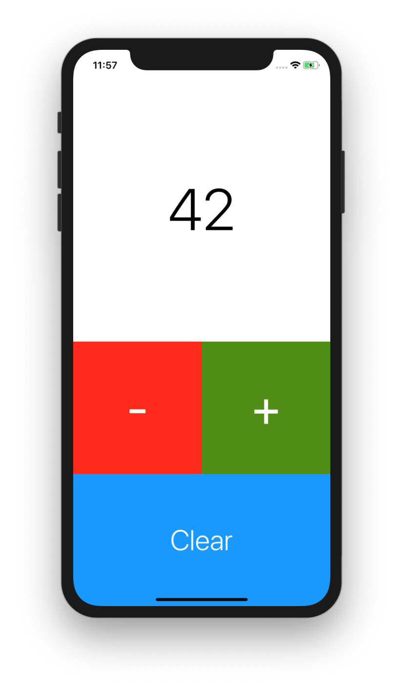

# Lab 12: Objective-C Sampler

## Getting Started

1. Open Terminal and navigate to the `iosdecal-sp19` directory using `cd`.

2. Use `git pull` to fetch this lab's starter files.

Welcome to the sampler lab for Objective-C! In this lab, you'll be using Objective-C *(not Swift!)* to create a simple counter that can increment/decrement and clear a label. As an added challenge, **in this lab you'll be using the *bracket notation* for all function calls and property references!** Refer to the lecture slides for a reminder on what this means.

<center>

</center>

As a reminder, sampler labs are short mini-labs designed to introduce you to a particular concept. They should be fairly simple and straightforward to implement, and shouldn't take too long to complete. You only need to complete three out of the five sampler labs we assign to recieve full credit, so we recommend you do the ones that you think might be most relevant to your project or that you find the most interesting. You have until **April 30** to turn them in, so you're welcome to work on these in any order and at any time.

## Part 0: Getting Started

Open the file `TapCounter.xcodeproj` to start the lab. We have provided the following files for you to use. 

1. `Main.storyboard` - The main storyboard file. We've already laid out everything with constraints and stack views for you, but you may need to come back to define outlets and actions!

2. `ViewController.h` - The header file for our view controller. You'll be declaring instance variables and methods here before initializing/defining them in `ViewController.m`

3. `ViewController.m` - The main implementation file for our view controller. You'll be using the instance variables that you defined in your header, and you'll define your methods here.

Build and run the app in your simulator, and check that the UI is laid out properly and that the buttons are interactable. Once you've confirmed everything to be working, let's get started!

## Part 1: Getting the Label Working

For our counter app, we want to define an integer instance variable `count` to keep track of the number we've counted to so far. Define `count` in `ViewController.h`, and in `ViewController.m` set `count` to be equal to `0` when the view loads.

<small>*Note: When defining `count`, you should only use the `nonatomic` property. In this case, we're not using `strong` because we aren't referencing a pointer - C can handle integers natively!*</small>

Remember, **use bracket notation instead of dot notation for this lab!** Recall that in order to set a variable in bracket notation, you'll need to use the auto-generated setter method! Here's a quick reminder on the differences between dot and bracket notation:

```objc
self.myVariable         // dot notation
[self myVariable]       // bracket notation

self.myVariable = 20    // dot notation
[self setMyVariable:20] // bracket notation
```

Now that you've created a property for the count, let's hook it up to the label! In `ViewController.h`, create an outlet of type `UILabel`, and connect that outlet you defined to the label in Storyboard. Then, in `ViewController.m`, make the label display the current `count` on the view loading. You can use `[[self countLabel] setText:_]`, replacing `countLabel` with whatever you called your outlet.

<small>*Note: In order to display your integer inside the label, you may need to use the* `[NSString stringWithFormat:_]` *method. You may also want to take a look at [this](https://developer.apple.com/library/archive/documentation/Cocoa/Conceptual/Strings/Articles/formatSpecifiers.html) for some guidance on format strings.*</small>

If everything was implemented correctly, once you build and run your app, the "999" in the label previously should be replaced with the "0" you initialized `count` to be!

## Part 2: Defining Actions

Now, let's define the three actions that will correspond to our three buttons. Create IBActions in `ViewController.h` that correspond to the add, subtract, and clear buttons respectively. Remember, we're going to define these as minus (-) functions, since we want them to be instance rather than class functions so they'll link up to Storyboard!

Speaking of Storyboard, go there and connect the three buttons to the IBActions you just created.

Now, in `ViewController.m`, implement your three functions following these properties:

 - The add button should add one to the current value in the label
 - The subtract button should subtract one from the current value in the label, **with 0 being the minimum the counter can go.**
   - So for example, if the count is at 0 and the user taps subtract, nothing should happen
 - The clear button should reset the count to 0
 - After each button is pressed, the label should update with the current count

Remember to use the setter notation shown above to set `count`'s value! You may also find it useful to define a helper function specifically for updating the count label if you find yourself repeating code a lot.

After this, when you build and run your app you should be able to interact with it via the buttons!

## Part 3: Checkoff
Congrats on finishing this sampler lab - hopefully now you feel a little more comfortable working with Objective-C and thinking in bracket notation! Although you probably won't be using Objective-C at all for your custom app, it's still very useful to know how to read code written in the language in case you want to import some Obj-C classes into your Swift project.

As this lab is a sampler lab, you can check it off any time between when it is assigned and **Tuesday, 4/30**. Good luck with the rest of the sampler labs, and your final project!


<br><br>