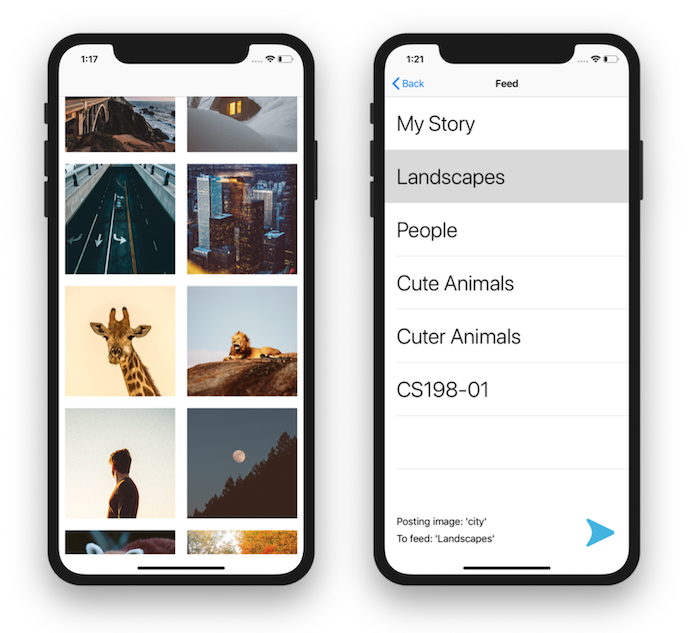
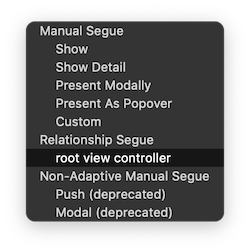
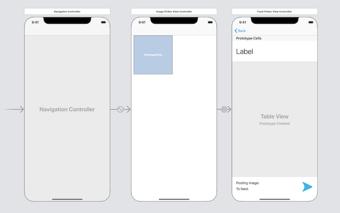

# Lab 5: Snapchat Navigation

## Getting Started

1. Open Terminal and navigate to the `iosdecal-sp19` directory using `cd`.

2. Use `git pull` to fetch this lab's starter files.

Today's lab will be a bit of a change of pace - we'll be starting the Snapchat 1 project! After you complete this lab, you can either duplicate your project or just extend it to work on the Snapchat 1 project.

In this lab, you'll complete the basic navigation elements for image selection. This includes the Collection View that will display your images, and the Table View that will allow you to select a feed to post to.

<center>

</center>

Open the file `Snapchat.xcodeproj` to start the lab. We have provided the following files for you to use. 

1. `Assets.xcassets` - We've included some images to start off with, along with some other image assets that you may need for the Snapchat 1 project. You're more than welcome to add/change the images we've provided though!

2. `Data.swift` – a simple Model to get you started. It includes a list of image names and a list of feed names. Feel free to use and/or extend this for your various ViewControllers.

If you want to replace some of the assets with selections of your own, you're welcome to do so! However, please leave the feed names as they are, because we're going to be using them in the second part of the Snapchat project!

You're welcome to work on this lab in any way you want, as long as the end result is the same - but this is the order we'd recommend you follow. Good luck, and don't be afraid to ask other students in your group or the TAs for help if you're stuck!

## Part 0: Review

Before you dive into this lab, take a good look at the demo for Lecture 5 posted on the course website. Familarize yourself with how we've laid out the app in Storyboard, what properties each of them have, and how they all connect to their respective bits of code.

It may also be helpful to take a look at the Apple Documentation for [TableViews](https://developer.apple.com/documentation/uikit/uitableview) and [CollectionViews](https://developer.apple.com/documentation/uikit/uicollectionview) (or at least skimming over the *Topics* section).

When you feel like you have a solid grasp of how TableViews and CollectionViews work, you should be able to answer the following questions:

1. How should the ViewController communicate with the TableView/ControllerView? What protocols must we extend, and what methods do we need to implement for it to work? 

2. How do Table and Collection cells work in practice - as in, what is actually happening when we dequeue and reuse a table cell?

3. What is the point of a "Prototype Cell"? What steps do we take to turn a Storyboard Prototype Cell into an actual table/collection cell that we can dequeue/reuse in our app?

4. What's an "identifier" (found in the Attributes Inspector), and why does our prototype cell need them? How does it differ from the "custom class" field in the Identity Inspector?

If you're stuck, ask a TA for help! Be sure to check out the [demo's post on Piazza](https://piazza.com/class/jrbay81cs73s4?cid=55) if you need some clarifications about the particularily confusing bits.

## Part 1: Storyboard

Now that you understand how TableViews and CollectionViews work, let's lay out our lab in Storyboard. In `Main.storyboard`, lay out and constrain objects according to the following guidelines:

1. Drag out a *Navigation Controller*, and delete the attached *Root View Controller* it comes with (click the yellow circle in the top bar  and press 'delete'). Set it as your Initial View Controller by selecting "Is Initial View Controller" in the Attributes Inspector.

2. Drag out a *View Controller* and put a *Collection View* in it. This will be your image picker. **Do not use a Collection View Controller!** We want you to become familiar with how delegation and data sources work in this lab, and the pre-made Controller abstracts too much away to be understandable. Constrain the Collection View to fill the View's safe area, and create a segue of type "Root View Controller" from the Navigation Controller to this View Controller.

<center>
</center>

3. In the Collection View, create a prototype cell (either through Attributes Inspector > Items or by dragging in a *Collection View Cell*). Place an *Image View* inside that prototype cell, and constrain it to have equal width and height and an aspect ratio of 1:1 (square). Be sure to give your prototype cell an identifier! You may also want to set your Image View's content mode to "Aspect Fill", so the images don't get squished.

4. Drag out another *View Controller*, and put a *Table View*, two *Label*s, and a *Button* in it. This will be your feed picker. **Do not use a Table View Controller!**. Set the button's image (in the Attributes Inspector) to be goButton. Constrain them to look like the reference picture below. Create a segue between your image picker view and feed picker view of type "Show", and give it an identifier.

5. In the Table View, (either through Attributes Inspector > Items or by dragging in a *Table View Cell*). Place a label inside that prototype cell, and format and constrain it however you wish. Be sure to give your prototype cell an identifier! 

When you're done, your storyboard should look like this:

<center>
</center>

## Part 2: Image Picker

Here comes the free-form part of the lab! **Using the view controller you created with the collection view, implement the Image Picker functionality.** 

Create a new file `ImagePickerViewController.swift` (if you choose to use the Cocoa Touch Class template, **make sure it's a subclass of `UIViewController`**)! When a user loads into the view, they should be presented with a collection of square images that they will be able to scroll through.

<small>
*Hint: Remember, we've given you a list of image names in Data.swift - you're welcome to use it!* 
</small>

Your app only needs to work in portrait mode, so you probably won't need to implement dynamically resizing collection view cells - but in case you want to, check out the Lecture 5 demo files and the [corresponding Piazza post](https://piazza.com/class/jrbay81cs73s4?cid=55) to find out how to do so. 

<details> <summary>**Hint 1**</summary>
You may find it easier to create a seperate file to house the controller for your CollectionViewCell. To do this, create a new file using the Cocoa Touch Class template and have it subclass `UICollectionViewCell`. After you specify the class you've created (in the cell's Identity Inspector), you should be able to create and manage outlets properly.
</details>

<details> <summary>**Hint 2**</summary>
If you're trying to run your app and nothing appears in your collection view, recall that you need to set your Collection View's `delegate` and `dataSource` to `self`! Don't forget to extend the `UICollectionViewDelegate` and `UICollectionViewDataSource` protocols in your class too!
</details>

<details> <summary>**Hint 3**</summary>
Recall that `indexPath` (in the respective methods where you might find it) is not an integer, but rather a constant of type `IndexPath`. If you want to get the item in an array at the position of indexPath, use `array[indexPath.item]`.
</details>

<details> <summary>**Hint 4**</summary>
Recall that you can define a UIImage in code with the following syntax:

```swift
UIImage(named: "asset_name_as_string")
```
</details>

## Part 3: Linking The Views

Now that you've gotten your Collection View to present images in a scrollable fashion, let's link it up to our Feed Picker. Create a new file `FeedPickerViewController.swift` (if you choose to use the Cocoa Touch Class template, **make sure it's a subclass of `UIViewController`**)! This will represent the Controller for our Feed Picker view.

**Implement segue functionality in your Image Picker controller.** Remember, you defined this segue earlier and gave an identifier to it!

When you're done with this section, you should be able to tap on any image in the Image Picker to segue to the Feed Picker. The top label in the Feed Picker after the segue should read `"Posting image: 'image-name'"`.

Don't worry about the TableView in the Feed Picker being blank for now - we'll fill it out in the next section!

<details> <summary>**Hint 1**</summary>
Here are some relevant functions you may want to take a look at: `didSelectItemAt` (part of `UICollectionViewDelegate`), `performSegue(withIdentifier: )`, `prepare(for segue: )`, and your destination View Controller's `viewDidLoad`.

Keep in mind, you can't directly set the text of the destination's label from `prepare(for segue: )`, so you'll need to pass it in to the destination as an instance variable of the destination and then use `viewDidLoad` to set its text!
</details>

<details> <summary>**Hint 2**</summary>
We can't reference the `indexPath` selected outside of the `didSelectItemAt` function. If you want to pass either `indexPath` or its respective image name to your destination View Controller, perhaps consider using an instance variable to "get the information out of" `didSelectItemAt`?
</details>

## Part 4: Feed Picker

This is the last stretch for the lab! Now that the segue between your Image Picker and Feed Picker works properly, **implement the Feed Table's functionality.**

The feed table should display rows containing each feed's name (remember, we've provided this for you in `Data.swift`). When a row is selected, the bottom label should update with `"To feed: 'destination_feed'"`. The blue "go" button doesn't need to do anything yet for this lab.

Keep in mind, you've already done something very similar for the Image Picker Collection View! If you're stuck, try referring back to the logic for that section; you'll find they're quite similar.

<details> <summary>**Hint 1**</summary>
You may find it easier to create a seperate file to house the controller for your TableViewCell. To do this, create a new file using the Cocoa Touch Class template and have it subclass `UITableViewCell`. After you specify the class you've created (in the cell's Identity Inspector), you should be able to create and manage outlets properly. It'll come with some pre-written functions (`awakeFromNib` and `setSelected`), but you're welcome to ignore those.
</details>

<details> <summary>**Hint 2**</summary>
If you're trying to run your app and nothing appears in your table view, recall that you need to set your Table View's `delegate` and `dataSource` to `self`! Don't forget to extend the `UITableViewDelegate` and `UITableViewDataSource` protocols in your class too!
</details>

## Part 5: Checkoff
Congrats on finishing this week's lab - it was a long one! We'll be checking you off on the following criteria:

1. **Collection View functionality** (square images, proper constraints, etc)
2. **The Image Picker > Feed Picker segue** (does the image name get passed through properly?)
3. **Navigation Bar functionality** (does the Back button actually take us back to the Image Picker?)
4. **Table View functionality** (does the feed name get displayed in the label properly?)

We'll also select a random question from the four listed in Part 0 to ask you, just to make sure you've conceptually understood what happened in this lab.

Now that you're done with this lab, you've already completed a sizeable chunk of the Snapchat 1 project! The full spec will be released *[date TBA]* and the full project will be due on **Tues 3/12 at 11:59PM**, so get started on that sooner rather than later!

<br>