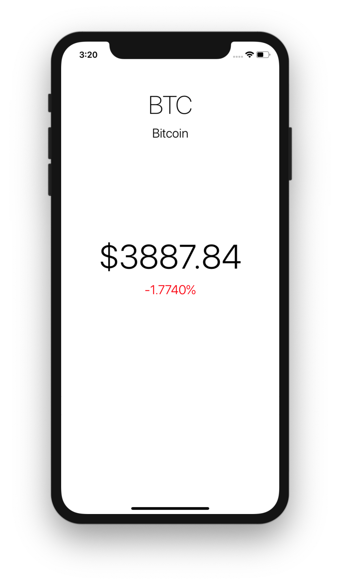
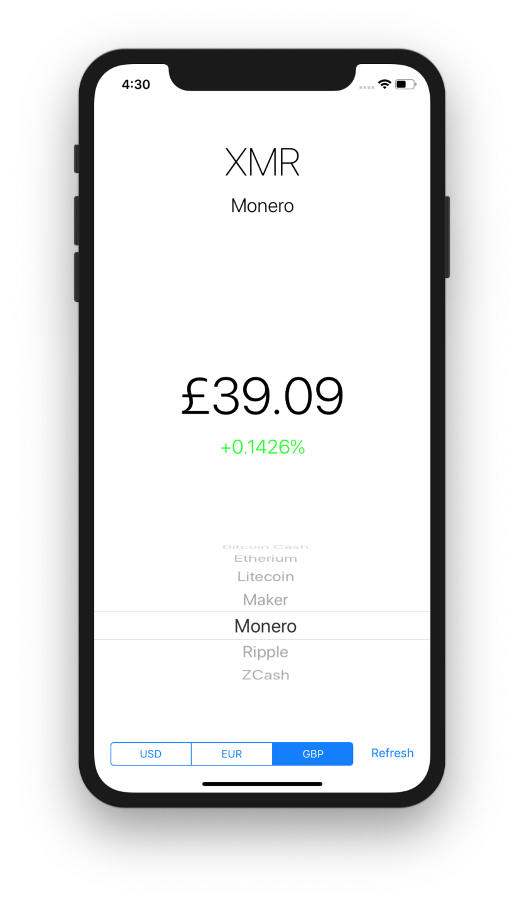

# Lab 6: Cryptocurrency Ticker

## Getting Started

1. Open Terminal and navigate to the `iosdecal-sp19` directory using `cd`.

2. Use `git pull` to fetch this lab's starter files.

For today's lab, you'll be creating a simple cryptocurrency ticker. Your app will fetch information from a third-party API using Swift's native networking capabilities, and will include options to switch to different crypto coins and currencies.

<center>

</center>

Open the file `CryptoTicker.xcodeproj` to start the lab. We've given you a bit more to start with than we usually do - here's what's included:

1. `Main.storyboard`: We've provided you with a basic Storyboard outline to get you started with the first section of this lab. You will be coming back to this file later to implement the Picker, Segmented Control, and "Refresh" button.

2. `ViewController.swift`: The main view controller file you'll be working with. We've defined a few outlets to get you started.

3. `Data.swift`: We've provided you with some arrays/dictionaries containing the data we want you to display in your Picker and Segmented Control. This includes:
   - `cryptoData: [String:String]` - a dictionary mapping cryptocurrency names to their ticker symbols
   - `cryptoNames: [String]` - an array of `cryptoData`'s keys in alphabetical order
   - `currencyData: [String:String]` - a dictionary mapping currency shortcodes to their symbols
   - `currencyNames: String` - an array of `currencyData`'s keys
   
You're welcome to work on this lab in any order you want, as long as the end result is the same - but this is the order we'd recommend you follow. Good luck, and don't be afraid to ask other students in your group or the TAs for help if you're stuck!

## Part 0: The API

We'll be using the [Cryptonator RESTful API](https://www.cryptonator.com/api/), specifically the "simple ticker" portion.

```
https://api.cryptonator.com/api/ticker/btc-usd
```

**Take some time to familiarize yourself with this API before starting the lab.** Click the link above, and read through the (short) documentation. Try entering the request URL into a new browser tab, or requesting a different base/target (you can refer to the ones in `Data.swift` to get started). Specifically, make a note of what fields are returned and where they are located - you can use this [JSON Formatter tool](https://jsonformatter.curiousconcept.com) to make the output more readable. 

## Part 1: Fetching and Parsing Data

Let's start out by implementing some default functionality for when the user first boots up our app. **Implement the fetching, parsing and displaying of data for `BTC-USD`.** By the end of this section, your app should be able to display data in this fashion:

- The topmost label should display the currency's three-letter ticker symbol ("BTC"), and the label below it should display the name ("Bitcoin").
- The big label in the center should display the symbol of the target currency ("$"), followed by the current price of the cryptocurrency *rounded to two decimal places*.
- The label below that should display the change over the past hour, followed by a percent sign. If the change is negative, set the label's color to red, otherwise set it to green.

<center>

</center>

<small>
*Note: We highly recommend you create a new function called `fetchAndDisplayData` or something similar, and call it in your `viewDidLoad` rather than just writing everything in `viewDidLoad`. This will save you a lot of grief in the long run, as you will only need to make slight modifications to this function in later sections rather than having to copy-paste and rewrite it.*
</small>

<details> <summary>**Hint 1**</summary>
Networking is a bit tricky to get the hang of in Swift! Recall what we need to set up a network connection:

1. Define a URL with the `URL(string: _)` constructor
2. Create a URLSession (`URLSession.shared` specifically)
3. Define a `dataTask` on that URLSession using the URL, and define what you want to do on completion with the `completionHandler` closure. (remember, this is where you can parse JSON!)
4. Start the `dataTask` with `.resume()`

For a concrete example, please see the Networking Lecture demo we did in class - the project file is on the course website.

</details>

<details> <summary>**Hint 2**</summary>

Recall that JSONDecoder uses a struct that extends the `Codable` protocol (or `Decodable`, if you want to get more specific) to parse JSON. Here's an example from the [Apple documentation](https://developer.apple.com/documentation/foundation/jsondecoder), if you need a quick reference.
</details>

<details> <summary>**Hint 3**</summary>

Recall that we can't actually edit Storyboard elements from inside the networking closure, as it's not being run in the main thread! To get around this, we can use

```swift
DispatchQueue.main.async {
	// code here
}
```
Be sure to only use this sparingly and only for what is strictly necessary - forcing unnecessary instructions onto the main thread is a great way to slow your app to a halt!

</details>

<details> <summary>**Hint 4**</summary>

You can set a label's color with the `.textColor` property, and you can define a color with the `UIColor.[colorname]` literal. See [this StackOverflow answer](https://stackoverflow.com/a/25840201) for an example.

</details>

## Part 2: Converting Currencies

Now let's extend your app a bit more. In Storyboard, add a **Segmented Controller** and a **Button** labeled "Refresh", and constrain them properly (to the bottom of the view). You can set the number of segments and their names using Storyboard, no need to do it programmatically for this lab.

<center>

</center>

Connect an outlet and action for the segmented control (see Hint 2), and an action for the button in `ViewController.swift`. Then, implement the following functionality:

- The segmented control should default to "USD" (If you defined USD as the first segment, this should happen automatically)
- Changing the segmented control and pressing "Refresh" should update the information displayed with the appropriate API call (`BTC-USD`, `BTC-EUR`, and `BTC-GBP` respectively). 
- The proper currency symbol should be displayed before the monetary amount, and the value should still be rounded to two decimal points.

<center>

</center>

<details> <summary>**Hint 1**</summary>

If you took our advice above about placing the networking functionality in its own function, implementing the code for this function should be a very easy task! It should only involve passing in a new parameter, changing around the URL, and changing how some of the labels are displayed.

</details>

<details> <summary>**Hint 2**</summary>

Segmented Controls are a bit weird in that they require both an outlet and an action to work properly but don't require having a delegate/datasource. Take a look at [this resource](https://www.ioscreator.com/tutorials/segmented-control-ios-tutorial) for an example of how to implement a Segmented Control - you can skip most of the fluff about AutoLayout and the labels though.

</details>

## Part 3: The Cryptocurrency Picker

Finally, let's give users the option to select between different cryptocurrencies. In Storyboard, drag in a **Picker View**, place it above the Segmented Control and Button, and constrain/define an outlet for it accordingly.

We haven't covered Picker Views previously in this class, but that's okay, because Pickers utilize a delegate and datasource! 

Remember, you'll need to have `ViewController.swift` extend `UIPickerViewDelegate` and `UIPickerViewDataSource`, and set the Picker's `.delegate` and `.dataSource` to `self`. Here is the [documentation for UIPickerView](https://developer.apple.com/documentation/uikit/uipickerview) to get you started. See Hint 1 for a bit of clarification if you're stuck.

Since you should have a good understanding of delegates and datasources by now from Table Views and Collection Views, you should be able to implement the following:

- Your ticker should display the list of cryptocurrencies in alphabetical order (you can use `cryptoNames` in `Data.swift` for this)
- The default value for your ticker should be "Bitcoin" (if you use `cryptoNames` this should happen by default)
- Selecting a cryptocurrency in the picker and a currency in the segmented controller then pressing "Refresh" should update all the labels above with data from the appropriate API call.

<center>

</center>

<details> <summary>**Hint 1**</summary>

Here are the relevant functions you may want to look at:

- `numberOfComponents(in pickerView: _)` (required)
- `numberOfRowsInComponent` (required)
- `titleForRow`
- `didSelectRow`

Take a look at [this tutorial](https://codewithchris.com/uipickerview-example/) for a concrete example of how to implement a Picker View. You can skip the part about adding more components, as our picker will only have one component (the name of the cryptocurrency).

</details>


## Part 4: Checkoff
Congrats on finishing this week's lab! We'll be checking you off on the following criteria:

1. **Default Data Loading**: Does your app load `BTC-USD` by default?
2. **Text Formatting**: Does the price displayed include the currency symbol, and is the change percentage colored?
3. **Segmented Controller and Picker**: Does changing the respective value and pressing "refresh" update the data in the labels to something that we would expect?

We'll also ask you to walk us through how the networking and JSON parsing parts of your code work, so be prepared to answer that!

<br>


