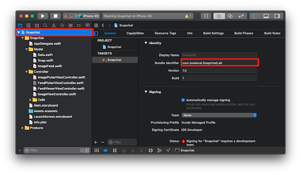

# Lab 7: Snapchat Networking

## Getting Started

If you haven't downloaded CocoaPods yet, run the command `sudo gem install cocoapods` in your Terminal or <a href="https://brew.sh">download Homebrew</a> and run `brew install cocoapods`. As stated in Lecture, we recommend Homebrew but it does take a considerable while to install/update.

In today's lab, we'll be integrating our Snapchat project with Firebase. This will allow us to keep a cloud-based record of all the snaps we post.  

You have two choices before starting: 

1. Build off your original Snapchat Project
2. Build off our staff solution, <a href="https://drive.google.com/uc?export=download&id=1mO0gZPADyxqZkDeqlid9HQwjigQCfZlA">linked here</a>

## Part 1: Set up Firebase

Before we write any code, let's set up a new Firebase project. 

1. Go to the <a href="https://firebase.google.com">firebase website</a> and press "Get Started". 
2. Create a new project by pressing "Add project"
3. Name it something catchy

Now, you should see the Firebase console. This is going to be the dashboard for all your Firebase-y needs. 

We want to link our app to our Firebase instance, so on the main screen press the iOS logo. 

Follow the steps on the website and you should be linked up! Remember, your iOS bundle ID is located in your Project Overview - the top icon in your navigation pane. 

**Important - If you're using our staff solution, rename the bundle identifier to something unique, generally `com.your-name.project-name`.**

**Also Important - Once you start modifying your Podfile, also type `pod 'Firebase/Firestore'` underneath `pod 'Firebase/Core'` to add the Firestore Database to your project**

 
**Hint 1**

After running the terminal command `pod init`, a textfile called Podfile will be created. Use any text editor to add the lines `pod 'Firebase/Core'` and `pod 'Firebase/Firestore'` underneath the line `# Pods for [project-name]`. Don't forget to save the file before calling `pod install`!

 
**Hint 2**

After running `pod install`, you will notice that a new file of type `.xcworkspace` is created in your project directory. Make sure to **close your Xcode project** and **open the xcworkspace** before writing any code. 

You may have to wait a while for your app to build, but once Firebase has detected that you've communicated with their servers move on to part 2.

## Part 2: Writing to the Database

Now that you've connected your project to Firebase, it's time to set up the Firestore database. 

1. Navigate to Firebase's Database section on the sidebar and press "Create database".
2. Select "Start in test mode" and press "Enable"

The console you see now will start populating as soon as you add some data to it. Let's do just that.

Navigate to the function in your project where you create a new Snap (`ImageFeed.addSnap` in the staff solution). 

Add code here to push the Snap to our Firestore database (refer to the lecture slides as a reference). You will not be able to store the UIImage directly with Firestore, so find a way to store the image's filename as a string instead.

All Snap properities, eg. `user`,`date`, `seen`, and `image` (with the UIImage replaced for a string) should be stored under each Snap instance in Firebase. 

 
**Hint 3**

You can't just get the filename from a UIImage instance, so you'll need to store the filename separately when initalizing a new Snap - this will require some tweaking of the Snap class if you're using the staff solution. 

 
**Hint 4**

For reference, you will probably use the method `db.collection("collection-name").document("document-name").setData([String:Any], merge: true)`. If no document or collection exists with the name you provide, it will automatically add a new one for you. 

The addition of `merge: true` will merge the data with existing documents of the same name, instead of overwritting all of its properties (For instance, if you're just trying to change the `seen` attribute of a snap, you don't want to overwrite all the snap's other data).

If you can demonstrate the following properties, you can check off for this lab: 

1. Your database updates when you add a snap
2. Your database changes the snap's `seen` attribute in the database after viewing the image. 

## Part 3: Reading from the Database (1pt Extra Credit)

The logical next step would be to also read your data from Firebase instead of your local data structures. 

Use the lecture slides and <a href="https://firebase.google.com/docs/firestore/query-data/get-data">the Firestore documentation</a> to populate your Feed table view with the data currently stored on Firebase. 

This is will likely take a little longer than the previous part, and as such we will give *1 point of extra credit* to anyone who completes this portion by Tuesday. 
