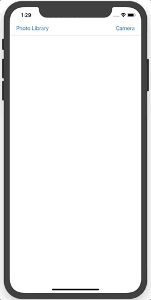

# Lab 8: Camera Sampler

## Getting Started

1. Open Terminal and navigate to the `iosdecal-sp19` directory using `cd`.

2. Use `git pull` to fetch this lab's starter files.

Welcome to the sampler lab for `UIImagePickerController` and friends! In this lab, you'll be implementing a simplified version of UIImagePickerController. You'll learn how to use it to both pick photos from your phone's photo library, and to have the users take a photo with the device's camera. **Note that UIImagePickerController is not the same as the AVCaptureSession, etc. that we've been talking about in lecture.** It is a pre-built implementation of some key AVCapture functionality, and is much easier to use at the cost of flexibility.

As a reminder, sampler labs are short mini-labs designed to introduce you to a particular concept. They should be fairly simple and straightforward to implement, and shouldn't take too long to complete. You only need to complete three out of the five sampler labs we assign to recieve full credit, so we recommend you do the ones that you think might be most relevant to your project or that you find the most interesting. You have until **April 30** to turn them in, so you're welcome to work on these in any order and at any time.


<center>

</center>

Open the file `Camera.xcodeproj` to start the lab. We have provided the following files for you to use. 

1. `Main.storyboard` - The main storyboard file. Everything here should already be set up for you, so you won't need to touch anything. You should still look through it and understand what the components are doing!

2. `ViewController.swift` - Our main controller file, and where you'll be writing your code for this lab. We've already connected the outlets and actions that you'll need.

You're welcome to work on this lab in any way you want, as long as the end result is the same - but this is the order we'd recommend you follow. Good luck, and don't be afraid to ask other students in your group or the TAs for help if you're stuck!

## Part 1: Photo Library

Once you're done taking a look through our starter files and understand what is happening, let's start by implementing the photo library picker. To do this, we'll need to first configure a UIImagePickerController.

First, we need to **make the ViewController class extend `UIImagePickerControllerDelegate` and `UINavigationControllerDelegate`.** The picker delegate is responsible for configuring the settings of our image picker, and the navigation delegate handles the showing and dismissing of the actual picker controller. You'll use them both in this section.

**In the `photoLibraryButtonPressed()` IBAction, initialize a `UIImagePickerController()` called `picker`.** Then, set `picker`'s delegate to `self`, since we want our ViewController class to be able to set `picker`'s settings.

Now, let's define the source type. For this section, **set `picker.sourceType` to `.photoLibrary`**. [Here's a list](https://developer.apple.com/documentation/uikit/uiimagepickercontroller/sourcetype) of valid entries for `sourceType` (under Topics > Constants).

Finally, let's present our image picker. Call `self.present()`, and pass in `picker` as the view controller we want to present. You can set the other arguments to whatever you want, but in general if you're not planning to do anything special after presenting the view controller it's generally a good idea to have `animated` as `true` and `completion` as `nil`.

If all goes well, the image picker should pop up after pressing the "Photo Library" button! You can even select a photo and the picker will go away, but nothing displays in the image view. Let's fix that in the next section.


## Part 2: Displaying a Chosen Image

Turns out, we need to access the image that was chosen in the `didFinishPickingMediaWithInfo` method (from `UINavigationControllerDelegate`). Below all the other functions, **define the `didFinishPickingMediaWithInfo` method**. Much like TableView's `cellForRowAt`, etc. the function name is actually `imagePickerController` and the element's name is called `didFinishPickingMediaWithInfo`, so you'll probably  need to use Xcode's tab-complete functionality to fill out the correct method.

Now that we've defined that method, we now have access to a dictionary called `info`, which contains all the information we need about what was selected and anything else that happened. **Set `imageView`'s image to the image we selected from the picker.** You can access this value in the `info` dictionary with key `UIImagePickerController.InfoKey.originalImage` (although you may have to convert it to a UIImage first).

Finally, because we've overriden the default implementation of this method, we need to manually dismiss the image picker. Similarly to what we did above to display the picker, **call `dismiss()` at the end of the function to dismiss the controller.** Again, you should set `animated` to `true` and `completion` to `nil`, as we're not performing any special functionality while dismissing.

Now, if you try to run your app, you'll see that we can access the photo library via the picker, select a photo, and have the photo display in our Image View!

## Part 3: Camera

As it turns out, UIImagePickerController is so flexible that we're already 95% of the way to having a working camera implementation with the code we've already written.

**Copy-paste the code you wrote in `photoLibraryButtonPressed` to `cameraButtonPressed`, and modify its source to work with the camera rather than the photo library**. You shouldn't need to change too much.

<small> *Hint: Take a look at the [valid sourceType types](https://developer.apple.com/documentation/uikit/uiimagepickercontroller/sourcetype) if you're stuck!*
</small>

When you test your app in the simulator, you'll notice that it stutters a bit, and then crashes with this error:

```
Camera[67268:3639170] [discovery] errors encountered while discovering extensions:
Error Domain=PlugInKit Code=13 "query cancelled" 
UserInfo={NSLocalizedDescription=query cancelled}
```

This is because the simulator doesn't have any cameras built in, as it's only simulating an iOS device on your computer! In order to test the camera functionality, you'll need to connect an actual iOS device to your computer.

## Part 4: Testing On a Device

Unfortunately, this is a bit harder than just plugging in a device and hoping for the best - physical iOS devices require apps to be code-signed, and there are a few extra steps to get that to work. You'll need to set up a (free) Apple Developer account, and properly configure a development certificate that has your device registered to it.

Fortunately, Apple has drastically simplified this process over the past few years (it used to take hours!) - now most of it happens automatically. **Follow [this guide](https://codewithchris.com/deploy-your-app-on-an-iphone/) to get your account and certificate set up.**

When you're ready to deploy and test your app, connect your iOS device to your computer with a cable, and unlock it. **Make sure that "Automatically Manage Signing" is checked, and that "Team" is set to your account.** The fist time you try to deploy to your device, Xcode might try to set it up for development. This can take a long while (up to 20 minutes), so don't disturb Xcode or unplug your device while this process is happening.

Now that you've successfully deployed your app to your device, you can test it with full functionality! The camera button should take you to a camera "view" where you can take (and confirm) a photo, and the photo library should use photos from your device.

## Part 5: Checkoff
Congrats on finishing this sampler lab - hopefully you have a idea now of how to implement camera functionality in your own app! As part of the checkoff, we'll want to see this lab running on your own device (to check the camera functionality), so feel free to pre-load the binary if you want to save a bit of time.

As this lab is a sampler lab, you can check it off any time between when it is assigned and **Tuesday, 4/30**. Good luck with the rest of the sampler labs, and your final project!


<br>