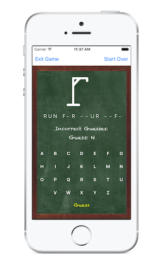
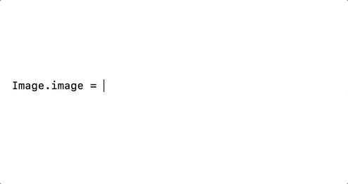

# Project 1: Hangman

**Due Thurs 2/28 at 11:59 PM**

<details> <summary>**Quick Navigation** (expand)</summary>

[toc]

</details>

## Overview

In this project, you will be working in teams of up to two to make an iOS application for the Hangman game. Users should be able to:

- start a game, 
- make guesses for a phrase, 
- see their progress toward the phrase,
- see a list of previously guessed incorrect letters, 
- see how many guesses they have left (indicated by a hangman image - we'll provide some basic images but consider making your own!), 
- be alerted of a win or loss, and start a new game afterwards.

This project will be relatively free-form; you'll receive full credit as long as your app meets the basic requirements we have set. Feel free to customize your app in whichever ways you want though! Here's a screenshot from a past project submission for some inspiration:

<center>

</center>

## Getting Started

Begin by pulling onto your local computer as usual:

1. Open Terminal and navigate to the `iosdecal-sp19` directory using `cd`.

2. Use `git pull` to fetch this project's starter code.

We haven't provided you with much to start this project because we want you to get practice with creating an app from (almost) scratch. We've included some image assets for you to use (see `assets.xcassets`), but other than that you're on your own for this project. 

If you get stuck, refer to the lecture slides and demos - specifically for Lecture 3 (AutoLayout + MVC). Don't be afraid to ask other groups or TAs for help if you need it. Good luck!

## Requirements

### The Basics (1pt)

- **Must demonstrate proper use of MVC!** Don't just cram everything in your Controller and call it a day! Be able to adequately explain how you divided your game's logic between your model and controller.
- Neat, legible code with comments explaining things as appropriate.


### Game View (2pt)

- A UILabel that displays the "`_`"s corresponding to each word in the provided puzzle string
- A UILabel that displays the incorrect guesses thus far
- A TextField (where the user enters a letter as a guess)
  - <small>*If you decide to implement a custom keyboard, this is not required*</small>
- The user should only be able to guess a single letter
- A "Guess" button which determines whether the letter entered in the textfield is correct or not, and updates the game accordingly
- A UIImageView that represents the "state" of the Hangman, with appropriate images for each "state"
- If that letter appears in the puzzle string, the corresponding "`_`" should be replaced by the correctly guessed letter
- If that letter does not appear in the puzzle string, that letter should be added to a UILabel keeping track of `"Incorrect Guesses: "`, and the Hangman image should update to represent the number of incorrect guesses


### Game Logic and States (1 pt)

- Be able to load phrases from an external `.plist` file, located in your model.
- Be able to handle spaces in phrases appropriately (and make sure you include some phrases with spaces in your `.plist`)
- Include a win state, indicated by an alert (Pop up box). This should prevent additional guesses.
- Include a fail state, indicated by an alert (Pop up box). This should prevent additional guesses.
- Include a "Restart" button, which starts a new game

### Bells & Whistles (up to 1pt extra credit)

We'll give partial Bells & Whistles extra credit as we see fit - only truly exceptional projects will earn the full point.

- Customize your app's design! This can include, but is not limited to:
  - Custom images for the Hangman states
  - A "theme" for your game, ex: chalkboard, outer space, etc.
  - Sounds for guessing correctly and incorrectly and/or game win and loss.
- A better input method than a keyboard and UITextField. Maybe a custom keyboard, perhaps?


## Tips and Hints

### Loading Phrases from a File

For your model, you'll need to be able to load phrases from an external file. You can do this with **Property List** files, or `.plist` for short. In this case, we recommend you create a plist representing an Array of Strings that contains all your phrases.

You can create a plist directly in Xcode by going to *File > New > File* in your menubar, and selecting "Property List" (under Resource). Give it a name like `phrases.plist`, and put it in your "Model" folder group.

You can add new items to your plist by right-clicking the top row (the drop down labeled "Root") and selecting "Add Row". Then, double-click on the empty Value field to assign the row a value. It may also be worth changing Root's type to Array from Dictionary, in the drop-down under Type.

Now that you have all your possible phrases stored in your plist as an Array of Strings, you can initialize the `phrases` NSArray in your model with this code:

```swift
var phrases : NSArray!
    
init() {
    // Replace "phrases" with your plist's filename
    let path = Bundle.main.path(forResource: "phrases", ofType: "plist")
    phrases = NSArray.init(contentsOfFile: path!)
}
```

### Working with Image Assets

Somewhere in your controller, you'll probably want to update a UIImageView representing your game progress with new images.

We've included some starter images in `assets.xcassets` (labeled `hangman1` to `hangman7`). To reference one of these images in your code, use the `Image` literal and double-click it to select which image to refer to.

For example, if we have a UIImageView called `Image`, we can set the current image programatically like so:

<center>

</center>

<small>
*Note: You'll need to have built your project at least once for this to work - otherwise, double-clicking the Image literal won't do anything.*
</small>

We highly reccomend you replace the Hangman images we've provided with ones of your own. To do this, double-click `Assets.xcassets` to bring the Asset Catalog up, then in the "+" menu at the bottom click *Create Image Set*. From there, you can rename your asset in the sidebar, and drag-and-drop an image in (refer to the assets we've provided to see where everything should go).

### Alerts (Pop-Up Boxes)

Part of our criteria requires you to use alerts to display certain changes in the game state. See [this Apple Developer article](https://developer.apple.com/documentation/uikit/uialertcontroller) for a quick guide on how to configure and display an alert.

If you want to customize your alerts even more, read [this article](https://learnappmaking.com/uialertcontroller-alerts-swift-how-to/) for tips on how to do so. 

## Submission

Each group only needs to submit once. Your submission for this project consists of two parts:

1. Project Files
2. Presentation Video

### Project Files

You'll be submitting your Xcode project folder, zipped up. You can do this by right-clicking the outermost `Hangman` folder, and selecting "Compress".

**It's your responsibility to make sure we can run your project**, so before submitting, try unzipping your file and make sure it still builds and runs properly. We'll severely dock your score if we can't run your project, so be warned!


### Presentation Video
You and your partner (if applicable) must create a short 1-2 minute screencast presenting your project and talking about your design decisions. QuickTime works great for this - you can start a new screen recording with *File > New Screen Recording*, and set your microphone with the drop-down menu next to the record button. This video doesn't need to be polished or scripted/edited, we just want to see you demonstrating your own project and hear about how it came together!

If you are working with a partner for this project, both people must appear in the voiceover for your video - no exceptions! Feel free to use our class's office hours and labs to coordinate and record.

In your video, you must show/address the following topics:

 - **Demonstrate how your app works**. Show us your `.plist` file in Xcode, then run your app in the simulator and show your app's features (you can use the "Requirements" section as a guideline for this). It doesn't need to be particularly detailed, we just want to see your app working. Point out any Bells & Whistles you included here too!

 - **Show and explain how your app satisfies MVC**. How does your app divide functionality between your model and controller? How does the model, view, and controller communicate with each other?

 - (if partners) **How was the work divided?** Who worked on what? Did each person take different "sections" of the project to complete on their own, or did both people work together the whole time?

 - **What went well? What could be improved?** This doesn't need to be particularly long - maybe a couple sentences max. If you're working with a partner, both people must address this question individually *(as in, both partners must tell us what went well for them and what could be improved for them)*. If you have any feedback for us about this project, this would be a great place to tell us!

### Submitting Your Project

Fill out [this Google Form](https://docs.google.com/forms/d/e/1FAIpQLSfmG1GhUcQoPtkaqzKhUgEQ7qkz2VOIlQGsqc2-mllOThjImw/viewform?usp=sf_link) to submit your project. Only one submission is required per group, but make sure both peoples' names/emails/SIDs are correct before submitting. Attach your project as a .zip and your screencast as a .mov/.m4v (or some other appropriate file type) in the appropriate fields.

**This project is due Thurs 2/28 at 11:59 PM. If you need accommodations (DSP or emergency or otherwise), please contact us via private Piazza post at least 24 hours in advance. Otherwise, late submissions will receive 50% credit, and we will not be accepting late submissions after Sun 3/3, 11:59 PM**. 

 
<br><br><br>


