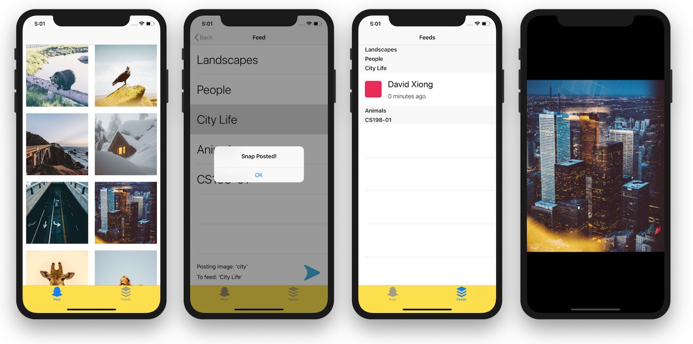
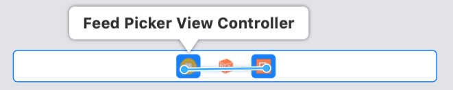

# Project 2: Snapchat 1

**Due Tues 3/12 at 11:59 PM**

<details> <summary>**Quick Navigation** (expand)</summary>

[toc]

</details>

## Overview

In this project, you will be making a clone similar to the Snapchat app! For the first part of this project, users should be able to:

1. Select an image from a set of predefined pictures
2. Post it to one of many predefined feeds
3. View all the posts in a feed in the "Snap" style of tapping on an image, viewing it, and not being able to see it again.

<center>

</center>

In the next project (*Snapchat 2*), we'll be implementing network connectivity (by connecting your posts to a realtime cloud database) and a photo picker and camera.

## Getting Started

There are no starter files for this project! Instead, create a copy of your completed Lab 5 project files (simply copy-pasting the outer `Snapchat` folder into a new `proj2` directory and renaming it `Snapchat1` will work just fine). **You will need to create more classes and files for this project.**

Just like the Hangman project, we don't have any official requirements on how it should look other than the functionality it should have. Our staff version is just one way you can do it. Any UI design that fulfills all the requirements is a valid UI and will be given full credit.

<small>
*Note: If you want to use the sample icon assets we've used in the staff solution, you can download them as a .zip [here](assets/icon_assets.zip). Some of these (for example, `goButton.png`) may already be in your Assets folder from Lab 5.*
</small>

If you get stuck, refer to the lecture slides and demos - specifically for Lecture 4 (Multiview Apps) and Lecture 5 (TableViews/CollectionViews). Don't be afraid to ask other groups or TAs for help if you need it. Good luck!

## Requirements

You **MUST** include all features listed under the "Posting Images" and "Image Feed" sections to receive full credit. However it's up to you to decide how to implement these features. If you want to check if your idea fits with these guidelines, make a private post on Piazza to ask.

### The Basics (1 point)

- **Must demonstrate proper use of MVC!** Don't just cram everything in your Controller and call it a day! Be able to adequately explain how you divided your game's logic between your model and controller.
- Neat, legible code with comments explaining things as appropriate.
- A Tab Bar Controller, with proper labels, to switch between your image picker and image feed views.

### Posting Images (1 point)

- UICollectionView of images to select from
- UITableView of feeds to post snaps to (adhering to the list of feeds found in `Data.swift`)
  - You **must** only use the list of feeds provided, do not add or remove any for this part of the project.
- UIButton to press in order to post to feed
- Some indicator (preferably a label) that displays what feed you have selected to post to
- Some indication that you have posted the snap (preferably an alert)

- **Required Control Flow**
 - User selects image to post, is taken to the feed picker.
 - User selects feed to post to (Cannot select multiple!)
 - User sees the feed they're posting to and clicks the post button
 - User is alerted that Snap has been posted and is taken back to the image picker screen

### Image Feed (2 points)

- UITableView **must be** split into sections based on feed
- Each section should contain UITableViewCells with the poster's name, how long ago it was posted, and a status indicator image (read/unread). If there are no snaps in a section, it should remain empty.
<small>
  - You may hard-code any placeholder name for this part of the project
  - Your timestamp **must** follow the format *"`x` minutes ago"* or *"`x` hours ago"*, and must display the latter if the Snap is more than an hour old.
</small>
- Tapping on a UITableViewCell should open the image full screen 
  - The image should adhere to the "Aspect Fit" content mode so as to not appear stretched.
  - The background should be black, and it should be visible if the image does not fit the whole screen.
- Tapping on the opened image should dismiss it and mark the corresponding UITableViewCell as "read"
  - Read images should not be viewable again.

- **Required Control Flow**
 - User selects a snap to view by tapping on it
 - The entire screen should only have the image on it (no NavBar or TabBar here!)
 - Tapping the image should dismiss the image
 - Image should be marked as read with the "read" image
 - Image should not be viewable again

### Bells & Whistles (up to 1pt extra credit)

We'll give partial Bells & Whistles extra credit as we see fit - only truly exceptional projects will earn the full point.

- Customize your app's design! This can include, but is not limited to:
  - Custom images to select from in your Collection View! Promote your own Instagram/Snapchat photos, perhaps? 😉
  - A custom (but consistent) color scheme for your app

**Note that you'll be using this project again to implement the Snapchat 2 project!** As such, it may be worth saving any functionality-changing Bells & Whistles for then.

## Tips and Hints

Here are some hints for some of the more common issues to get you started. We highly recommend you read through all of them, but if you want to challenge yourself feel free to read these as you end up needing them.

<details> <summary>**[IMPORTANT] What order should this project be done in?**</summary>
<br>
Remember, you've already implemented a decent portion of the "Posting Images" requirements in Lab 5! The rest of this project should consist of implementing the missing functionality.

Here is one potential order you could do this project in:

 - Implement all features found in Lab 5
 - Define some sort of data structure in a model that can store your Snaps
 - Implement what happens when you press the "post" button after selecting a feed row (add Snap to storage data structure, present an alert, unwind)
 - Implement the image feed view and its cells, reading off the Snap storage data structure you defined.
 - Implement the final image popup view and its associated functionality.

</details>

<details> <summary>**[IMPORTANT] Representing a Snap in your model**</summary>
<br>
If you decide to create a class/struct to represent Snaps, **we highly recommend you represent the image as a UIImage rather than a String**. In Snapchat 2 you'll be implementing camera functionality; if you represent the image in your Snap class as a String you'll have to go back and change them all to a UIImage to work with the camera producing images that are not predefined.
</details>

<details> <summary>**Representing your feed in your model**</summary>
<br>
Although we've said in the past that Models are required to be classes, you're more than welcome to temporarily break that paradigm for this project, but only for the data structure that contains your feed.

For example, if you create a new Swift file called `ImageFeed.swift` and in it you define a dictionary `feedData` containing all your Snaps, you will be able to access the `feedData` dictionary as a global variable, for example, you can write something like this in one of your Controllers:

```swift
return feedData[feed]
``` 
</details>

<details> <summary>**Unwinding from an alert**</summary>
<br>
Unwinding from an alert is slightly different from unwinding from an IBAction in that it requires the use of a handler (essentially, a closure to attach to a certain object, in this case a UIAlertAction).

Rather than simply calling the `dismiss` function as we always have, you'll need to manually define an exit segue. In the View Controller *you are segueing to*, define an IBAction with argument `(segue:UIStoryboardSegue)`. Then, create a manual exit segue by control-dragging from the "exit" icon on the top of the view controller to the yellow circle, and selecting the IBAction you just created.

<center>

</center>

Give that segue an identifier, and now you should be able to use it in `performSegue` in the handler that you attach to your UIAlertAction.

If you need more details, see this [StackOverflow answer](https://stackoverflow.com/a/29965441) and [this guide](https://www.andrewcbancroft.com/2015/12/18/working-with-unwind-segues-programmatically-in-swift/).
</details>

<details> <summary>**Adding sections to a TableView**</summary>
<br>
UITableViews have a property called "sections", and you can write out those respective methods in order to add sections to your TableView. It's a bit different from lumping everything together into one section as we've been doing before, but not too hard to get the hang of.
 
Here's the [Apple documentation](https://developer.apple.com/documentation/uikit/uitableview) for UITableViews (do a quick ctrl+f on "section" to see what methods you have available for use), and here's a [small guide](https://www.ralfebert.de/ios-examples/uikit/uitableviewcontroller/grouping-sections/) (just read the code in Step 5; note what extra functions you need to implement and how you need to change `numberOfRowsInSection` and `cellForRowAt` to comply with these changes).
</details>

<details> <summary>**"Posted `x` minutes/hours ago"**</summary>
<br>
To manage dates and times in Swift, use the [Date](https://developer.apple.com/documentation/foundation/date) object for now. Without giving too much away, its `timeIntervalSinceNow` function might come in handy here.

In the "real world", there are much better ways to manage dates and time in Swift, and we'll cover a couple of them later in the class.
</details>

## Submission

Each group only needs to submit once. Your submission for this project consists of two parts:

1. Project Files
2. Presentation Video

### Project Files

You'll be submitting your Xcode project folder, zipped up. You can do this by right-clicking the outermost `Snapchat1` folder, and selecting "Compress".

**It's your responsibility to make sure we can run your project**, so before submitting, try unzipping your file and make sure it still builds and runs properly. We'll severely dock your score if we can't run your project, so be warned!


### Presentation Video
You and your partner (if applicable) must create a short screencast presenting your project and talking about your design decisions. QuickTime works great for this - you can start a new screen recording with *File > New Screen Recording*, and set your microphone with the drop-down menu next to the record button. This video doesn't need to be polished or scripted/edited, we just want to see you demonstrating your own project and hear about how it came together!

If you are working with a partner for this project, both people must appear in the voiceover for your video - no exceptions! Feel free to use our class's office hours and labs to coordinate and record.

In your video, you must show/address the following topics:

 - **Demonstrate how your app works**. Run your app in the simulator and show your app's features (you can use the "Requirements" section as a guideline for this). Be sure to demonstrate posting multiple times in different sections, and that viewed Snaps cannot be viewed again. It doesn't need to be particularly detailed, we just want to see your app working.

 - **Show and explain how your app satisfies MVC**. How does your app divide functionality between your model and controller? What controllers is your app using? How does the model, view, and controller communicate with each other?

 - (if partners) **How was the work divided?** Who worked on what? Did each person take different "sections" of the project to complete on their own, or did both people work together the whole time?

 - **What went well? What could be improved?** This doesn't need to be particularly long - maybe a couple sentences max. If you're working with a partner, both people must address this question individually *(as in, both partners must tell us what went well for them and what could be improved for them)*. If you have any feedback for us about this project, this would be a great place to tell us!

### Submitting Your Project

Fill out this Google Form <small>**[Link Pending]**</small> to submit your project. Only one submission is required per group, but make sure both peoples' names/emails/SIDs are correct before submitting. Attach your project as a .zip and your screencast as a .mov/.m4v (or some other appropriate file type) in the appropriate fields.

**This project is due Tues 3/12 at 11:59 PM. If you need accommodations (DSP or emergency or otherwise), please contact us via private Piazza post at least 24 hours in advance. Otherwise, late submissions will receive 50% credit, and we will not be accepting late submissions after Fri 3/15, 11:59 PM**. 


<br><br>


